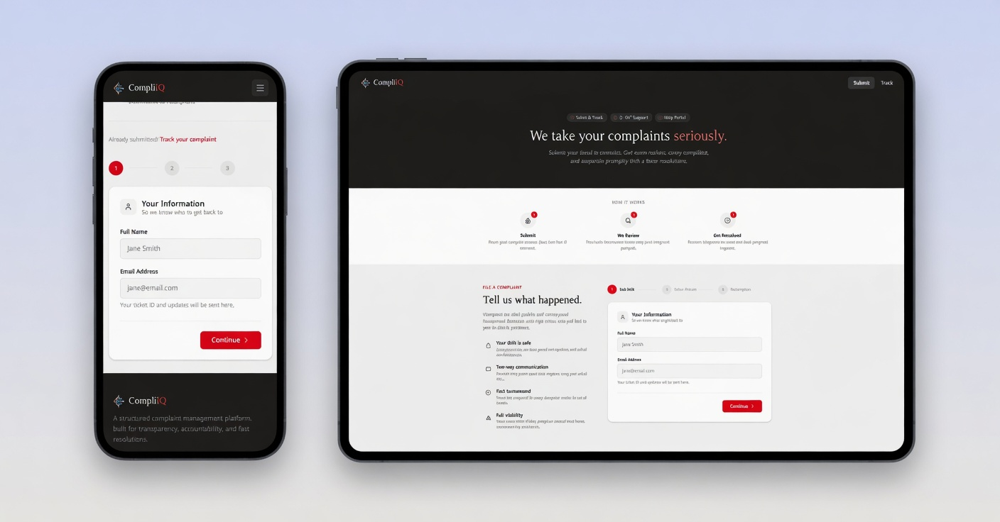
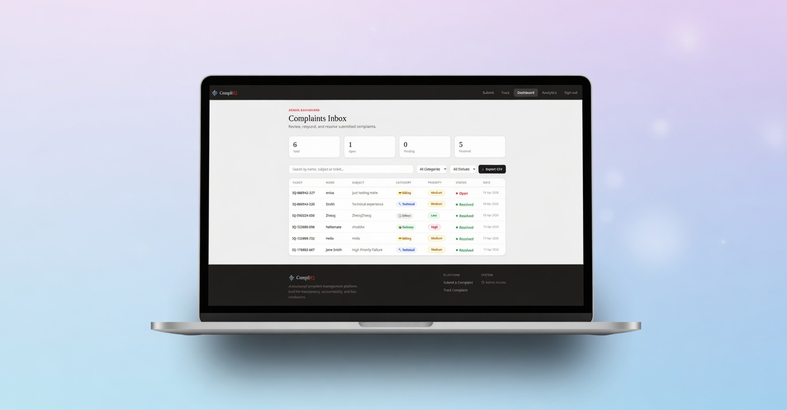
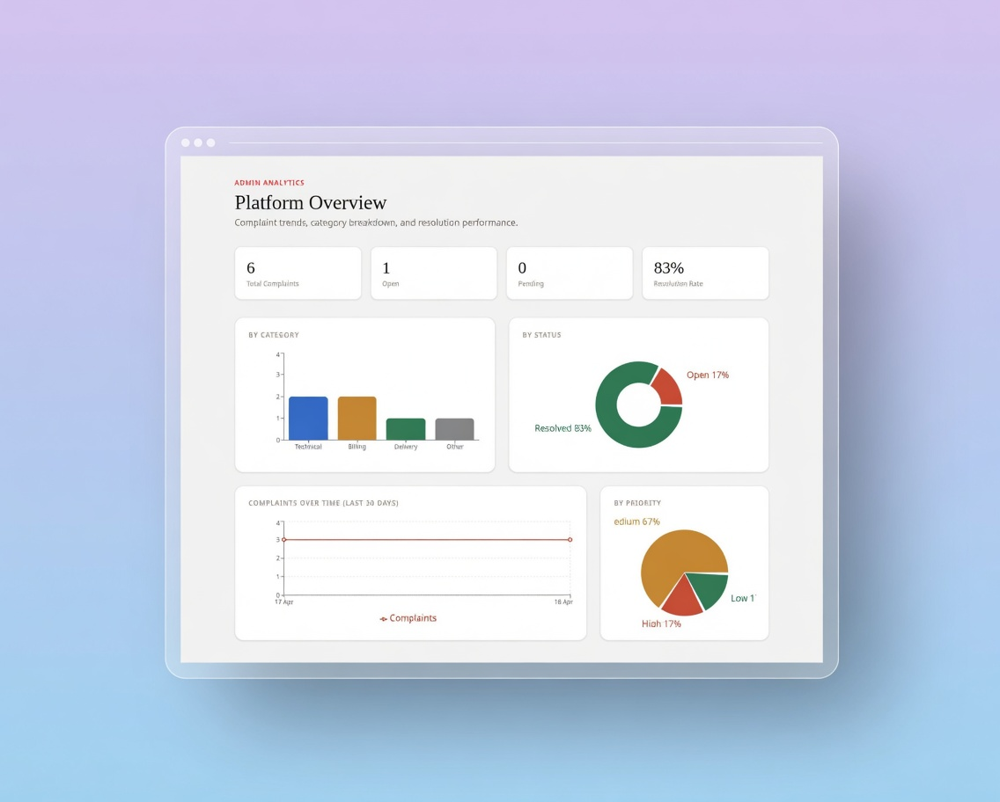
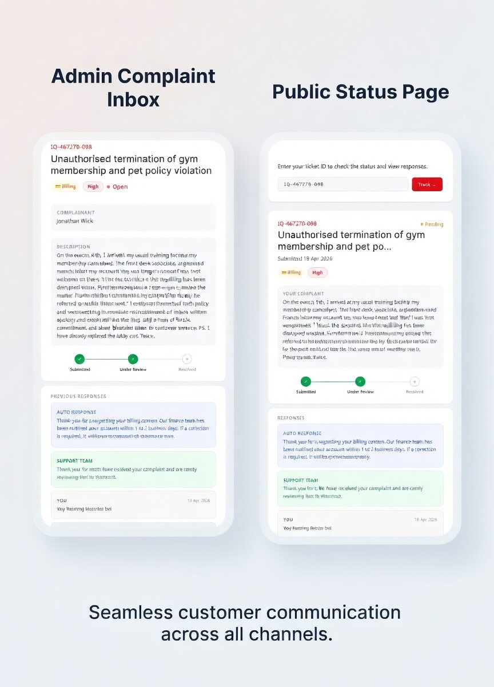

# ComplaitIQ


A structured, full-stack complaint management platform built for transparency, accountability, and fast resolutions. Designed and built as a group project for CSC - University of Port Harcourt.



---

## Overview

ComplaitIQ is a production-grade complaint portal that allows users to submit complaints, receive instant auto-responses, track progress in real time, and communicate with support staff through a full conversation thread. Admins manage complaints through a secure dashboard with analytics and CSV export.

This is not a demo - it is built to the same standard as a real shipped product.

---

## Features

### Public
- Multi-step complaint submission form with auto category detection
- Unique ticket ID generation per complaint (`IQ-XXXXXX-XXX`)
- Instant auto-response on submission based on complaint category
- Submission confirmation email sent to complainant
- Ticket tracker - paste your ticket ID and see full status, timeline, and all responses
- Follow-up messaging on open tickets without needing to resubmit

### Admin
- JWT-protected admin dashboard
- Complaints inbox with search, filter by category and status
- Complaint detail modal with full conversation thread
- Template-based and custom response system
- Email delivery to complainant on every admin response
- Status management (Open, Pending, Resolved)
- Analytics page with charts: by category, by status, by priority, complaints over time
- CSV export of all complaints

---

## Tech Stack

| Layer | Technology |
|---|---|
| Frontend | React 19, TypeScript, Tailwind CSS v4, Vite |
| Backend | Node.js, Express 5, TypeScript |
| Database | PostgreSQL 18 |
| Auth | JWT, bcryptjs |
| Email | Nodemailer via Gmail SMTP |
| Charts | Recharts |
| Icons | Lucide React |
| Package Manager | pnpm |

---

## Screenshots

| Page | Preview |
|---|---|
| Landing & Submit |  |
| Admin Dashboard |  |
| Analytics |  |
| Ticket Tracker |  |

---

## Local Setup

### Prerequisites

- Node.js 18+
- pnpm
- PostgreSQL 18

### Windows Users

The setup steps in this README are written for Linux. If you are on Windows;

- Install PostgreSQL from [postgresql.org/download/windows](https://www.postgresql.org/download/windows/) and use **pgAdmin** or the included SQL Shell (psql) to run the database setup commands
- Install Node.js from [nodejs.org](https://nodejs.org)
- Install pnpm via `npm install -g pnpm`
- Use **PowerShell** or **Git Bash** for all terminal commands
- The `psql` command must be added to your system PATH during PostgreSQL installation, make sure that checkbox is ticked
- Everything else (pnpm install, pnpm dev, etc.) works exactly the same

### 1. Clone the repository

```bash
git clone https://github.com/GOG-777/ComplaitIQ.git
cd ComplaitIQ
```

### 2. Set up PostgreSQL

```bash
sudo -u postgres psql
```

```sql
CREATE USER complaint_user WITH PASSWORD 'your_password';
CREATE DATABASE complaint_platform OWNER complaint_user;
GRANT ALL PRIVILEGES ON DATABASE complaint_platform TO complaint_user;
\q
```

Then run the schema:

```bash
psql -U complaint_user -d complaint_platform -h localhost -f server/schema.sql
```

### 3. Configure environment variables

Create `server/.env`:

```env
PORT=5000
DB_HOST=localhost
DB_PORT=5432
DB_NAME=complaint_platform
DB_USER=complaint_user
DB_PASSWORD=your_password
JWT_SECRET=your_long_random_jwt_secret_minimum_64_characters
JWT_EXPIRES_IN=8h
NODE_ENV=development
CLIENT_URL=http://localhost:5173
GMAIL_USER=your_gmail@gmail.com
GMAIL_APP_PASSWORD=your_16_char_app_password
```

### 4. Seed the admin account

```bash
cd server
npx ts-node src/scripts/seedAdmin.ts
```

Default credentials:
- Username: `admin`
- Password: `Admin1234!`

Log in and navigate to **Settings** to change your password immediately.

### 5. Install dependencies and run

**Server:**
```bash
cd server
pnpm install
pnpm dev
```

**Client (new terminal):**
```bash
cd client
pnpm install
pnpm dev
```

Visit `http://localhost:5173`

---

## Project Structure

```
ComplaitIQ/
├── client/
│   └── src/
│       ├── components/       # Header, Footer, UI components
│       ├── pages/            # SubmitPage, TrackPage, AdminDashboard, AnalyticsPage
│       ├── services/         # API layer (axios)
│       ├── types/            # Shared TypeScript interfaces
│       └── utils/            # Helpers and formatters
└── server/
    └── src/
        ├── config/           # Database connection
        ├── controllers/      # Request handlers
        ├── middleware/        # Auth, validation, error handling
        ├── routes/           # Express route definitions
        ├── services/         # Auto-response and email logic
        └── types/            # Shared TypeScript types
```

---

## Database Schema

Three core tables:

**complaints** - stores all submitted complaints with ticket ID, category, priority, status, and timestamps.

**responses** - linked to complaints, stores auto, admin, and user follow-up messages.

**admins** - stores hashed admin credentials for dashboard access.

An `update_updated_at` trigger automatically updates the `updated_at` timestamp on every complaint change.

---

## API Reference

### Public Endpoints

| Method | Endpoint | Description |
|---|---|---|
| POST | `/api/complaints` | Submit a new complaint |
| GET | `/api/complaints/track/:ticket_id` | Get complaint by ticket ID (public, email stripped) |
| POST | `/api/complaints/track/:ticket_id/followup` | Submit a follow-up on an open ticket |

### Admin Endpoints (JWT required)

| Method | Endpoint | Description |
|---|---|---|
| POST | `/api/auth/login` | Admin login |
| GET | `/api/complaints` | List all complaints with filters |
| GET | `/api/complaints/:id` | Get full complaint with responses |
| PATCH | `/api/complaints/:id/status` | Update complaint status |
| POST | `/api/complaints/:id/respond` | Send admin response |
| GET | `/api/complaints/analytics/summary` | Analytics data |
| GET | `/api/complaints/export/csv` | Export all complaints as CSV |

---

## Security

- All admin routes protected with JWT bearer tokens
- Passwords hashed with bcryptjs (cost factor 12)
- Rate limiting on public submission endpoint (10 requests per 15 minutes)
- HTTP security headers via Helmet
- CORS restricted to the client origin
- Input validation and sanitization on every route via express-validator
- Parameterized SQL queries throughout, no raw string interpolation
- Email addresses never exposed on public track endpoint

---

## Gmail App Password Setup

1. Go to your Google Account settings
2. Search for "App Passwords"
3. Create a new app password for "Mail"
4. Copy the 16-character code into `GMAIL_APP_PASSWORD` in your `.env`

---

## License

This project is licensed under the MIT License. See the [LICENSE](./LICENSE) file for details.

## Built By

GOG - Computer Science, University of Port Harcourt (UNIPORT), 400 Level.
